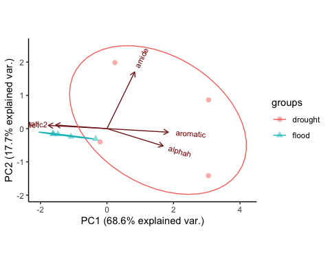

nmrrr - statistics
================

This vignette demonstrates the general workflow for performing
multivariate statistical analyses using relative abundance data.

This vignette uses the `relabund_cores` output generated by vignette
\#2.

------------------------------------------------------------------------

**Note: both PERMANOVA and PCA need data in wide form.**

i.e., one column for each group, and one row for each sample

``` r
relabund_wide = 
  relabund_cores %>% 
  ungroup() %>% 
  pivot_wider(names_from = group, values_from = relabund)
```

``` r
head(relabund_wide)
```

    ## # A tibble: 6 x 7
    ##   Core  treatment aliphatic1 aliphatic2 alphah aromatic amide
    ##   <chr> <chr>          <dbl>      <dbl>  <dbl>    <dbl> <dbl>
    ## 1 27    drought         68.4       4.61   0.45     26.6  0   
    ## 2 28    drought         70.4       5.86   0.91     21.8  1.05
    ## 3 29    drought         40.5       0      4.89     54.6  0   
    ## 4 30    drought         30.0       2.77   2.18     64.3  0.79
    ## 5 31    flood           82.9       4.08   0        13.1  0   
    ## 6 32    flood           73.9      13.2    0        12.8  0

------------------------------------------------------------------------

## PERMANOVA (Permutational Multivariate Analysis of Variance)

The PERMANOVA allows us to determine if a given treatment has a
statistically significant influence on the multivariate dataset.

PERMANOVA is can be computed using the `adonis()` function from the
`vegan` package.

``` r
library(vegan)

adonis(relabund_wide %>% 
         dplyr::select(where(is.numeric))  ~ 
         treatment,
       data = relabund_wide)
```

    ## 
    ## Call:
    ## adonis(formula = relabund_wide %>% dplyr::select(where(is.numeric)) ~      treatment, data = relabund_wide) 
    ## 
    ## Permutation: free
    ## Number of permutations: 999
    ## 
    ## Terms added sequentially (first to last)
    ## 
    ##           Df SumsOfSqs  MeanSqs F.Model      R2 Pr(>F)  
    ## treatment  1   0.16255 0.162551  6.0965 0.46551  0.041 *
    ## Residuals  7   0.18664 0.026663         0.53449         
    ## Total      8   0.34919                  1.00000         
    ## ---
    ## Signif. codes:  0 '***' 0.001 '**' 0.01 '*' 0.05 '.' 0.1 ' ' 1

------------------------------------------------------------------------

## PCA (Principal Components Analysis)

A PCA allows us to collapse the multivariate dataset into
pseudo-variables (components).

The PCA data can be visualized using a biplot to determine the spread
of/distance among the datapoints.

A biplot can be plotted using the `ggbiplot` package, available for
download from GitHub:
[miraKlein/ggbiplot](https://github.com/miraKlein/ggbiplot)

Install the package from GitHub:

``` r
install.packages("devtools")
devtools::install_github("miraKlein/ggbiplot")
```

### Perform PCA analysis

We use the wide-form of relabund for PCA.

We split the wide-form into thw numerical data (num) and the grouping
variables (grp), and perform PCA on `num`.

``` r
fit_pca_function = function(dat){
  relabund_pca=
    dat %>% 
    ungroup %>% 
    dplyr::select(-1)
  
  num = 
    relabund_pca %>% 
    dplyr::select(c(aliphatic1, aliphatic2, aromatic, alphah, amide))
  
  grp = 
    relabund_pca %>% 
    dplyr::select(-c(aliphatic1, aliphatic2, aromatic, alphah, amide)) %>% 
    dplyr::mutate(row = row_number())
  
  pca_int = prcomp(num, scale. = T)
  
  list(num = num,
       grp = grp,
       pca_int = pca_int)
}

## PCA input files
pca_data = fit_pca_function(relabund_wide)
```

### Creating the PCA biplot

The `ggbiplot()` function follows similar nomenclature to `ggplot()` for
customization.

``` r
library(ggbiplot)

## PCA plot
(gg_pca = 
    ggbiplot(pca_data$pca_int, obs.scale = 1, var.scale = 1,
             groups = as.character(pca_data$grp$treatment), 
             ellipse = TRUE, circle = FALSE, var.axes = TRUE, alpha = 0) +
    geom_point(size=2,stroke=1, alpha = 0.5,
               aes(shape = groups,
                   color = groups))+
    theme_classic()+
    NULL)
```

<!-- -->

------------------------------------------------------------------------

<details>
<summary>
Session Info - click to open
</summary>

Date run: 2021-07-10

    ## R version 4.0.2 (2020-06-22)
    ## Platform: x86_64-apple-darwin17.0 (64-bit)
    ## Running under: macOS Catalina 10.15.7
    ## 
    ## Matrix products: default
    ## BLAS:   /Library/Frameworks/R.framework/Versions/4.0/Resources/lib/libRblas.dylib
    ## LAPACK: /Library/Frameworks/R.framework/Versions/4.0/Resources/lib/libRlapack.dylib
    ## 
    ## locale:
    ## [1] en_US.UTF-8/en_US.UTF-8/en_US.UTF-8/C/en_US.UTF-8/en_US.UTF-8
    ## 
    ## attached base packages:
    ## [1] stats     graphics  grDevices utils     datasets  methods   base     
    ## 
    ## other attached packages:
    ##  [1] ggbiplot_0.55   vegan_2.5-7     lattice_0.20-41 permute_0.9-5  
    ##  [5] readxl_1.3.1    forcats_0.5.1   stringr_1.4.0   dplyr_1.0.6    
    ##  [9] purrr_0.3.4     readr_1.4.0     tidyr_1.1.3     tibble_3.1.2   
    ## [13] ggplot2_3.3.3   tidyverse_1.3.1
    ## 
    ## loaded via a namespace (and not attached):
    ##  [1] Rcpp_1.0.6        lubridate_1.7.10  assertthat_0.2.1  digest_0.6.27    
    ##  [5] utf8_1.1.4        plyr_1.8.6        R6_2.5.0          cellranger_1.1.0 
    ##  [9] backports_1.2.1   reprex_2.0.0      evaluate_0.14     highr_0.8        
    ## [13] httr_1.4.2        pillar_1.6.1      rlang_0.4.10      rstudioapi_0.13  
    ## [17] Matrix_1.3-2      rmarkdown_2.6.6   labeling_0.4.2    splines_4.0.2    
    ## [21] munsell_0.5.0     broom_0.7.6       compiler_4.0.2    modelr_0.1.8     
    ## [25] xfun_0.20         pkgconfig_2.0.3   mgcv_1.8-33       htmltools_0.5.1.1
    ## [29] tidyselect_1.1.0  fansi_0.4.2       crayon_1.4.1      dbplyr_2.1.1     
    ## [33] withr_2.4.1       MASS_7.3-53       grid_4.0.2        nlme_3.1-152     
    ## [37] jsonlite_1.7.2    gtable_0.3.0      lifecycle_1.0.0   DBI_1.1.1        
    ## [41] magrittr_2.0.1    scales_1.1.1      cli_2.5.0         stringi_1.5.3    
    ## [45] farver_2.0.3      fs_1.5.0          xml2_1.3.2        ellipsis_0.3.2   
    ## [49] generics_0.1.0    vctrs_0.3.8       tools_4.0.2       glue_1.4.2       
    ## [53] hms_1.0.0         parallel_4.0.2    yaml_2.2.1        colorspace_2.0-0 
    ## [57] cluster_2.1.0     rvest_1.0.0       knitr_1.31        haven_2.3.1

</details>

------------------------------------------------------------------------
